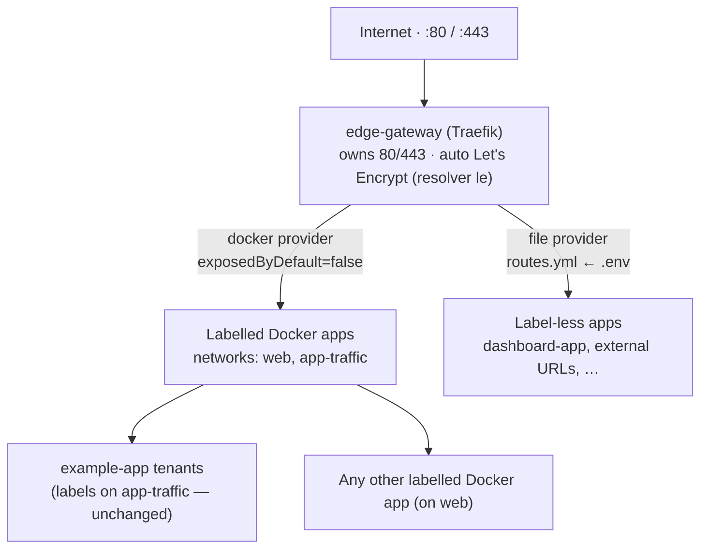

<div align="center">


<br/>

<a href="https://github.com/A7med-Sghaier/edge-gateway">
  
</a>

<br/><br/>

[](https://traefik.io)
[](https://www.docker.com)
[](https://letsencrypt.org)
[](LICENSE)


</div>

**Edge Gateway** is a single, portable **Traefik** edge reverse-proxy for a whole
server — the **only** process that binds `:80` / `:443` and owns **all** TLS
certificates. It terminates TLS with automatic **Let's Encrypt** certificates and
forwards every inbound request to the right backend through **two complementary
providers**: a **file provider** driven by one `.env` file for label-less apps, and a
**Docker provider** that auto-discovers any container already carrying Traefik labels —
so a multi-tenant **example-app** stack plugs in with **zero label changes**.

This repository is currently private while it is prepared as a portfolio case study.

> [!NOTE]
> Only one process on a host can bind `:80`/`:443`. Edge Gateway is deliberately that
> single process: routes for label-less apps are declared in `.env` and hot-reloaded
> without restarting Traefik, while labelled containers (including existing multi-tenant
> stacks) are discovered automatically over shared Docker networks — no per-app proxy.

<div align="center"></div>

## Portfolio Value

Edge Gateway demonstrates production-oriented platform and DevOps engineering:

- Single-responsibility edge proxy that owns ports `:80`/`:443` and all TLS for a host
- Automatic Let's Encrypt certificate issuance and renewal (TLS-ALPN challenge)
- Env-driven, hot-reloading route configuration rendered by a POSIX `sh` generator
- Two-provider Traefik design (file + Docker) with `exposedByDefault: false` opt-in
- Zero-touch integration of an existing multi-tenant stack via shared Docker networks
- Secret-free repository — per-server config and certificates stay out of version control
- Documented, reversible cutover from a legacy nginx + per-app Traefik setup

## Architecture



| Provider | Used for | How routing is declared |
| --- | --- | --- |
| **File** | Apps with **no** Traefik labels | `ROUTE_*` blocks in `.env` → rendered to `traefik/dynamic/routes.yml`, hot-reloaded |
| **Docker** | Apps that **already** ship Traefik labels | Auto-discovered on `web` / `app-traffic`; `traefik.enable=true` opt-in |

## Tech Stack

| Area | Technology |
| --- | --- |
| Reverse proxy | Traefik v3.3 (file + Docker providers, TLS entrypoints) |
| TLS | Let's Encrypt / ACME, TLS-ALPN challenge, optional DNS-01 wildcard |
| Runtime | Docker Compose, shared external networks (`web`, `app-traffic`) |
| Route generation | POSIX `sh` script on Alpine 3.20, rendering Traefik dynamic config |
| Configuration | `.env` file-provider blocks + Docker labels |

<div align="center"></div>

## How it works

**File-provider apps (`.env`):**
- Routes live in `.env` as `ROUTE_1_*`, `ROUTE_2_*`, … blocks.
- On `up`, the `route-generator` container renders those into Traefik's
  file-provider config at `traefik/dynamic/routes.yml`.
- Traefik watches that file and hot-reloads — add a route without restarting Traefik.
- Backends are reached by **container name** over the shared `web` network
  (e.g. `http://dashboard-app:8080`), or by any external URL.

**Label-driven apps (Docker provider):**
- Any container with `traefik.enable=true` on the `web` or `app-traffic` network is
  discovered automatically — its own labels define routing, TLS, and middlewares.
- `exposedByDefault: false` means containers without that label are ignored.

## How example-app plugs in (zero label changes)

example-app already deploys each tenant as its own compose project whose
`api`/`admin`/`frontend` containers attach to the external **`app-traffic`** network
and carry per-tenant Traefik labels (routers, security headers, rate limits, admin IP
allowlist). Those labels already reference the exact names this edge uses — network
`app-traffic`, cert resolver `le`, entrypoints `web`/`websecure` — so once this edge
is attached to `app-traffic` (it is, see `docker-compose.yml`), it discovers and routes
every tenant automatically. **Nothing in the app tenant labels changes.**

The only app-side change is that its deploy must stop starting *its own* Traefik, since
this edge now owns `:80`/`:443`. That is gated by an `EDGE_EXTERNAL=true` env in
`exampleApp/scripts/run-tenant-prod.sh` (app still runs its shared mongo + autoheal).
See "Cutover" below.

<div align="center"></div>

## Quick start (per server)

```bash
# 1. Shared networks. `web` is generic; `app-traffic` is example-app's data
#    plane (the app deploy also creates it — creating it here first is harmless
#    and lets this edge start independently, e.g. after a reboot).
docker network create web
docker network create app-traffic   # skip if app already created it

# 2. Configure
cp .env.example .env
$EDITOR .env          # set ACME_EMAIL and any ROUTE_* blocks for label-less apps

# 3. Launch
docker compose up -d
```

That's it. Traefik requests a certificate per hostname automatically, and discovers all
labelled containers (incl. app tenants) on `web` / `app-traffic`.

## Add / change a route

1. Edit the `ROUTE_*` blocks in `.env`.
2. Regenerate the dynamic config (Traefik picks it up live):

```bash
docker compose run --rm route-generator
```

No Traefik restart needed.

## Connect a label-less app to the gateway

For an app that has **no** Traefik labels, add a `ROUTE_*` block (above) and just join
it to the shared `web` network — nothing else changes, and the app keeps its own private
network for its DB:

```yaml
services:
  dashboard-app:
    # ...existing config...
    networks:
      - web        # reachable by the gateway
      - internal   # app <-> db stays private
networks:
  web:
    external: true
  internal: {}
```

The app does **not** publish ports to the host and does **not** run its own Traefik.
Traefik forwards the original `Host` header, so a multi-tenant app resolves the tenant
exactly as it did behind nginx.

For an app that already **has** Traefik labels (like example-app), you don't touch
`.env` at all — just make sure its containers are on a network this edge is attached to
(`web` or `app-traffic`) and it's discovered automatically.

## Optional: Traefik dashboard

Set in `.env`:

```bash
DASHBOARD_HOST=traefik.example.com
DASHBOARD_AUTH=admin:$apr1$....      # from: htpasswd -nb admin 'password'
```

Regenerate and it's served (with basic auth) at that host over HTTPS.

<div align="center"></div>

## Cutover (retire nginx + app's own Traefik)

example-app currently runs its own Traefik under the `legacy-edge` compose project.
Because only one process can bind `:80`/`:443`, cutover swaps that for this edge in one
window.

1. On the server: `docker network create web` (`app-traffic` already exists).
2. *(Optional — avoids re-issuing certs.)* Copy the existing Let's Encrypt store so this
   edge reuses the certs app already obtained:
   ```bash
   docker cp legacy-edge-traefik-1:/letsencrypt/acme.json ./letsencrypt/acme.json
   ```
   (Otherwise certs are simply re-issued via TLS-ALPN on first request — fine for a
   handful of hostnames, within Let's Encrypt rate limits.)
3. Bring `edge-gateway` up on **alternate ports first** — temporarily map `8080:80` /
   `8443:443` in `docker-compose.yml` — while app's Traefik still serves prod. Verify it
   sees tenant routers and any file routes:
   ```bash
   curl -kI --resolve <tenant-host>:8443:127.0.0.1 https://<tenant-host>/
   ```
4. Maintenance window: stop app's Traefik, switch this edge back to `80:80` / `443:443`,
   relaunch:
   ```bash
   docker rm -f legacy-edge-traefik-1
   # restore 80:80 / 443:443 in docker-compose.yml
   docker compose up -d
   ```
5. Set `EDGE_EXTERNAL=true` in app's CI/prod tenant env so future tenant deploys never
   start Traefik again (they still deploy api/admin/frontend and run mongo + autoheal).
6. Retire nginx: `systemctl stop nginx && systemctl disable nginx`. Keep it installed one
   day as instant rollback, then remove. DNS is unchanged throughout — hostnames now
   resolve to this edge.

**Rollback:** unset `EDGE_EXTERNAL` (or set it `false`) and re-run a tenant deploy — app
starts its own Traefik again on `:80`/`:443` exactly as before.

## Wildcard certificates (optional)

`tlsChallenge` in `traefik/traefik.yml` issues one cert per hostname — great when
tenants are added occasionally. If you add tenants constantly under one parent
domain, switch to a **DNS-01 challenge** for a `*.example.com` wildcard cert so new
tenants need zero cert work. That requires your DNS provider's API credentials; see
the Traefik ACME `dnsChallenge` docs. The env-driven routing here stays identical.

## Repository Structure

```text
edge-gateway/
├── docker-compose.yml         # route-generator + traefik
├── .env.example               # copy to .env — routes + ACME email live here
├── assets/                    # README banner + divider (SVG)
├── traefik/
│   ├── traefik.yml            # static config (entrypoints, ACME, providers)
│   └── dynamic/               # generated routes.yml (gitignored)
└── scripts/
    └── generate-routes.sh     # .env  →  Traefik dynamic config
```

## License

Released under the [MIT License](LICENSE).

<div align="center">


**Ahmed Sghaier** · Senior Full-Stack Engineer
[a7med-sghaier.app](https://a7med-sghaier.app) · [GitHub](https://github.com/A7med-Sghaier) · [LinkedIn](https://www.linkedin.com/in/ahmed-sghaier-449778137)

</div>
