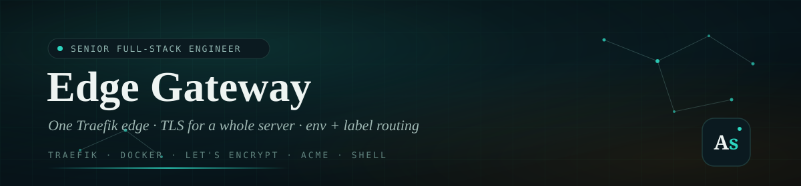
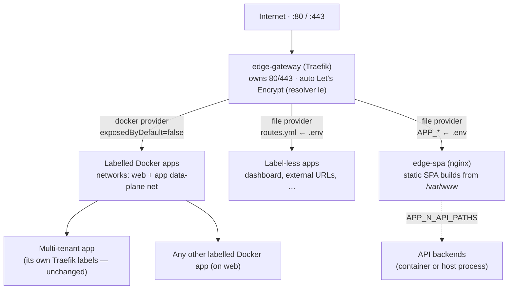

<div align="center">



<br/>

<a href="https://github.com/A7med-Sghaier/edge-gateway">
  
</a>

<br/><br/>

[](https://traefik.io)
[](https://www.docker.com)
[](https://letsencrypt.org)
[](LICENSE)


</div>

**Edge Gateway** is a single, portable **Traefik** edge reverse-proxy for a whole
server — the **only** process that binds `:80` / `:443` and owns **all** TLS
certificates. It terminates TLS with automatic **Let's Encrypt** certificates and
forwards every inbound request to the right backend through **two complementary
providers**: a **file provider** driven by one `.env` file for label-less apps, and a
**Docker provider** that auto-discovers any container already carrying Traefik labels —
so a multi-tenant app that already ships its own labels plugs in with **zero label
changes**. It also bundles a small **`edge-spa` nginx** that serves non-dockerized
frontend builds from the host's `/var/www`, so static SPAs need no per-app web server —
their routes, admin variants, and API/socket.io proxying are declared in the same `.env`.

Extracted from a live multi-server deployment and published as a portfolio case study.
Every hostname, server label, and filesystem path in this repository is a placeholder:
real values are supplied per server through environment variables and GitHub Secrets, so
the repo carries the **mechanism** and never a deployment's specifics.

> [!NOTE]
> Only one process on a host can bind `:80`/`:443`. Edge Gateway is deliberately that
> single process: routes for label-less apps are declared in `.env` and hot-reloaded
> without restarting Traefik, while labelled containers (including existing multi-tenant
> stacks) are discovered automatically over shared Docker networks — no per-app proxy.

<div align="center"></div>

## Portfolio Value

Edge Gateway demonstrates production-oriented platform and DevOps engineering:

- Single-responsibility edge proxy that owns ports `:80`/`:443` and all TLS for a host
- Automatic Let's Encrypt certificate issuance and renewal (TLS-ALPN challenge)
- Env-driven, hot-reloading route configuration rendered by a POSIX `sh` generator
- Two-provider Traefik design (file + Docker) with `exposedByDefault: false` opt-in
- Zero-touch integration of an existing multi-tenant stack via shared Docker networks
- Secret-free repository — per-server config and certificates stay out of version control
- Documented, reversible cutover from a legacy nginx + per-app Traefik setup

## Architecture



| Provider | Used for | How routing is declared |
| --- | --- | --- |
| **File** | Apps with **no** Traefik labels | `ROUTE_*` blocks in `.env` → rendered to `traefik/dynamic/routes.yml`, hot-reloaded |
| **File** | Static frontend SPAs (served by `edge-spa`) | `APP_*` blocks in `.env` → nginx server blocks + web/admin/API routers, hot-reloaded |
| **File** | Non-HTTP protocols (e.g. MongoDB) | `TCP_*` blocks in `.env` → a `tcp:` router on its own entrypoint, with optional TLS termination and IP allowlist |
| **Docker** | Apps that **already** ship Traefik labels | Auto-discovered on `web` or the app's own data-plane network; `traefik.enable=true` opt-in |

## Tech Stack

| Area | Technology |
| --- | --- |
| Reverse proxy | Traefik v3.7 (file + Docker providers, TLS entrypoints) |
| TLS | Let's Encrypt / ACME, TLS-ALPN challenge, optional DNS-01 wildcard |
| Runtime | Docker Compose, shared external networks (`web` + any app data-plane network) |
| Static SPA serving | `nginx:1.27-alpine` (`edge-spa`), builds bind-mounted from host `/var/www` |
| Route generation | POSIX `sh` script on Alpine 3.20, rendering Traefik dynamic config + edge-spa nginx config |
| Configuration | `.env` file-provider blocks (`ROUTE_*`, `APP_*`, `TCP_*`) + Docker labels |

<div align="center"></div>

## How it works

**File-provider apps (`.env`):**
- Routes live in `.env` as `ROUTE_1_*`, `ROUTE_2_*`, … blocks.
- On `up`, the `route-generator` container renders those into Traefik's
  file-provider config at `traefik/dynamic/routes.yml`.
- Traefik watches that file and hot-reloads — add a route without restarting Traefik.
- Backends are reached by **container name** over the shared `web` network
  (e.g. `http://dashboard:8080`), or by any external URL.

**Static SPAs (`APP_*` → `edge-spa`):**
- Each `APP_*` block renders (1) an nginx `server{}` per web/admin host into
  `nginx/generated/spa.conf` (served by the `edge-spa` container from the host's
  bind-mounted `/var/www`) and (2) Traefik routers: a web/admin router → `edge-spa`,
  plus — when `APP_N_API` is set — a higher-priority router for the API path prefixes
  → that API backend with a CORS middleware.
- The API prefixes default to `/api,/socket.io` and are set per app with
  `APP_N_API_PATHS`. Everything not matching them falls through to the SPA, so a
  prefix that is wrong (or missing its leading `/`) shows up as the API returning
  `index.html` — the generator rejects that shape rather than emitting it.
- Traefik reaches `edge-spa` by container name over `web` (`http://edge-spa:80`); there
  are no host ports. The `edge-spa` nginx is reloaded on deploy when its config changes.

**Raw-TCP backends (`TCP_*`):**
- For protocols that aren't HTTP — a database reached by a desktop client, say. They
  send no cleartext SNI, so they can't be multiplexed onto `:443` and each needs its
  own entrypoint.
- A `TCP_*` block renders a `tcp:` router + service, optionally with TLS termination
  (a Let's Encrypt cert on a real hostname, forwarded as plaintext to the backend)
  and an `ipAllowList` middleware.
- The **entrypoint itself is per-server static config**, so it is not declared in
  `.env`: each host adds it to `$RUNTIME_CONFIG_DIR/traefik.override.yml` (copy
  [`traefik/traefik.override.example.yml`](traefik/traefik.override.example.yml),
  which the deploy deep-merges over the repo's `traefik/traefik.yml`) and publishes
  the port from its own `docker-compose.override.yml`.
- Exposing a database this way is a real decision: without an allowlist it is
  reachable from the whole internet within hours of the port opening. An SSH tunnel
  exposes nothing and needs no gateway config — prefer it for occasional access.

**Label-driven apps (Docker provider):**
- Any container with `traefik.enable=true` on `web` — or on an app data-plane network
  this edge is attached to — is discovered automatically; its own labels define routing,
  TLS, and middlewares.
- `exposedByDefault: false` means containers without that label are ignored.

## How a labelled multi-tenant app plugs in (zero label changes)

Some apps already deploy each tenant as its own compose project whose containers attach
to a shared external network — the app's **data-plane network**, named whatever that app
calls it — and carry per-tenant Traefik labels: routers, security headers, rate limits,
IP allowlists. As long as those labels reference the same names this edge uses — the cert
resolver `le` and the entrypoints `web` / `websecure` — this edge discovers and routes
every tenant automatically once it is attached to that network. **Nothing in the app's
labels changes.**

That network name is deliberately **not** committed here: the base `docker-compose.yml`
declares only `web`, and each server attaches the edge to its own data-plane network(s)
from a local, gitignored `docker-compose.override.yml`:

```yaml
services:
  traefik:
    networks: [web, my-app-traffic]
networks:
  my-app-traffic:
    external: true
```

The only app-side change is that its deploy must stop starting *its own* Traefik, since
this edge now owns `:80` / `:443`. Gate that with a flag in the app's deploy (e.g.
`EDGE_EXTERNAL=true`) so it skips its bundled proxy while still starting its own supporting
services (database, healthchecks, and so on). See "Cutover" below.

## Quick start (per server)

```bash
# 1. Shared networks. `web` is the generic network label-less/labelled apps join.
#    Creating it here first is harmless and lets this edge start independently,
#    e.g. after a reboot.
docker network create web
# Plus your app's own data-plane network, if it has one and hasn't created it yet:
# docker network create my-app-traffic

# 2. Configure
cp .env.example .env
$EDITOR .env          # set ACME_EMAIL and any ROUTE_* blocks for label-less apps

# 3. Launch
docker compose up -d
```

That's it. Traefik requests a certificate per hostname automatically, and discovers every
labelled container on each network it is attached to.

## Add / change a route

1. Edit the `ROUTE_*` (proxied apps), `APP_*` (static SPAs), or `TCP_*` (raw-TCP
   backends) blocks in `.env`. A `TCP_*` route also needs its entrypoint in that
   server's `traefik.override.yml` and its port published from that server's
   `docker-compose.override.yml` — see "Raw-TCP backends" above.
2. Regenerate the dynamic config (Traefik picks it up live):

```bash
docker compose run --rm route-generator
# APP_* changes also update the edge-spa nginx config — reload it to apply:
docker compose exec edge-spa nginx -t && docker compose exec edge-spa nginx -s reload
```

No Traefik restart needed. (The deploy workflow runs the reload for you.)

## Connect a label-less app to the gateway

For an app that has **no** Traefik labels, add a `ROUTE_*` block (above) and just join
it to the shared `web` network — nothing else changes, and the app keeps its own private
network for its DB:

```yaml
services:
  dashboard:
    # ...existing config...
    networks:
      - web        # reachable by the gateway
      - internal   # app <-> db stays private
networks:
  web:
    external: true
  internal: {}
```

The app does **not** publish ports to the host and does **not** run its own Traefik.
Traefik forwards the original `Host` header, so a multi-tenant app resolves the tenant
exactly as it did behind nginx.

For an app that already **has** Traefik labels, you don't touch `.env` at all — just make
sure its containers are on a network this edge is attached to (`web`, or its own
data-plane network added via the local compose override) and it's discovered
automatically.

## Optional: Traefik dashboard

Set in `.env`:

```bash
DASHBOARD_HOST=traefik.example.com
DASHBOARD_AUTH=admin:$apr1$....      # from: htpasswd -nb admin 'password'
```

Regenerate and it's served (with basic auth) at that host over HTTPS.

<div align="center"></div>

## Cutover (retire an existing nginx / per-app Traefik)

If a host already runs its own proxy — a legacy nginx, or an app that bundles its own
Traefik — only one process can bind `:80` / `:443`, so cutover swaps that for this edge in
one window.

1. On the server: `docker network create web` (and the app's data-plane network if it does
   not exist yet).
2. *(Optional — avoids re-issuing certs.)* Copy an existing Let's Encrypt store so this edge
   reuses certificates already obtained:
   ```bash
   docker cp <old-traefik-container>:/letsencrypt/acme.json ./letsencrypt/acme.json
   ```
   (Otherwise certs are simply re-issued via TLS-ALPN on first request — fine for a
   handful of hostnames, within Let's Encrypt rate limits.)
3. Bring `edge-gateway` up on **alternate ports first** — temporarily map `8080:80` /
   `8443:443` in `docker-compose.yml` — while the old proxy still serves prod. Verify it
   sees tenant routers and any file routes:
   ```bash
   curl -kI --resolve <host>:8443:127.0.0.1 https://<host>/
   ```
4. Maintenance window: stop the old proxy, switch this edge back to `80:80` / `443:443`,
   relaunch:
   ```bash
   docker rm -f <old-traefik-container>
   # restore 80:80 / 443:443 in docker-compose.yml
   docker compose up -d
   ```
5. Set the app's `EDGE_EXTERNAL=true` (or equivalent) flag so future deploys never start
   their own proxy again (they still deploy the app and its supporting services).
6. Retire nginx: `systemctl stop nginx && systemctl disable nginx`. Keep it installed one
   day as instant rollback, then remove. DNS is unchanged throughout — hostnames now
   resolve to this edge.

**Rollback:** unset `EDGE_EXTERNAL` (or set it `false`) and re-run the app's deploy — it
starts its own Traefik again on `:80` / `:443` exactly as before.

## Wildcard certificates (optional)

`tlsChallenge` in `traefik/traefik.yml` issues one cert per hostname — great when
tenants are added occasionally. If you add tenants constantly under one parent
domain, switch to a **DNS-01 challenge** for a `*.example.com` wildcard cert so new
tenants need zero cert work. That requires your DNS provider's API credentials; see
the Traefik ACME `dnsChallenge` docs. The env-driven routing here stays identical.

## Repository Structure

```text
edge-gateway/
├── docker-compose.yml         # route-generator + traefik + edge-spa
├── .env.example               # copy to .env — ROUTE_*/APP_*/TCP_* routes + ACME email
├── CLAUDE.md                  # repository guidance / invariants
├── LICENSE                    # MIT
├── assets/                    # README banner + divider (SVG)
├── docs/
│   └── continuous-deployment.md   # self-hosted runner deploy model
├── .github/workflows/
│   └── deploy.yml             # matrix deploy, one job per edge server
├── traefik/
│   ├── traefik.yml            # static config (entrypoints, ACME, providers)
│   ├── traefik.override.example.yml  # per-server static overlay — copy to the server
│   └── dynamic/               # generated routes.yml (gitignored)
├── nginx/
│   └── generated/             # generated spa.conf for edge-spa (gitignored)
└── scripts/
    ├── generate-routes.sh     # .env  →  Traefik dynamic config + edge-spa nginx config
    └── install-runner.sh      # one-time self-hosted runner setup
```

Per-server state — `.env`, `docker-compose.override.yml`, `traefik.override.yml`,
`letsencrypt/` — is never committed. See
[docs/continuous-deployment.md](docs/continuous-deployment.md).

## License

Released under the [MIT License](LICENSE).

<div align="center">


**Ahmed Sghaier** · Senior Full-Stack Engineer
[a7med-sghaier.app](https://a7med-sghaier.app) · [GitHub](https://github.com/A7med-Sghaier) · [LinkedIn](https://www.linkedin.com/in/ahmed-sghaier-449778137)

</div>
